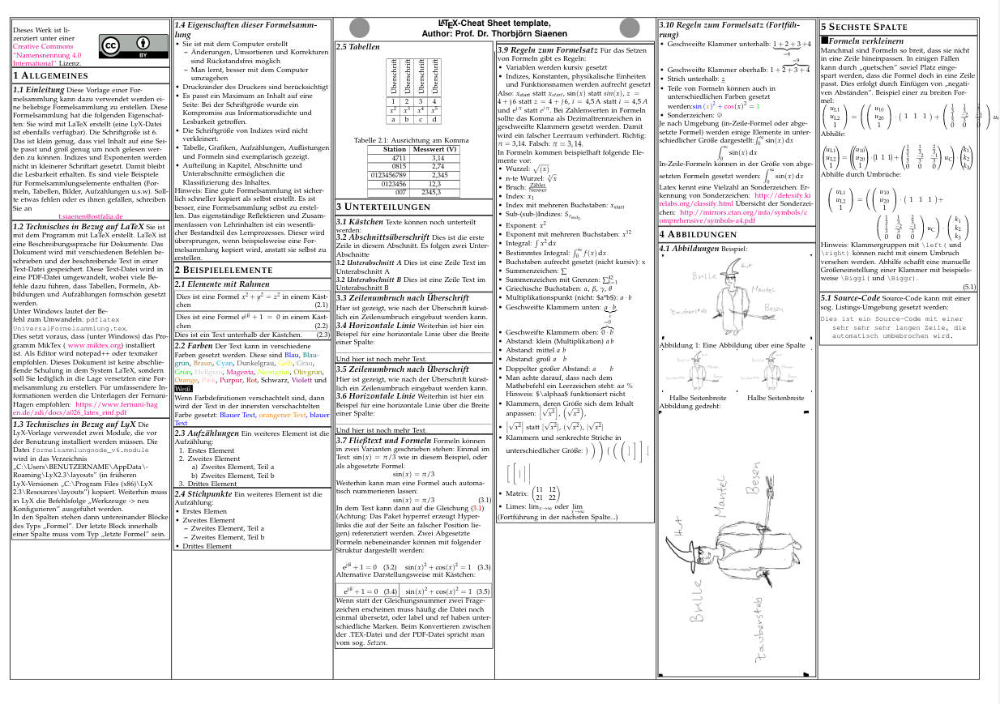

# Cheat Sheet Template
This is a template for a cheat sheet made in LyX or LaTeX.

This is how the result could look like:

This template has the following features:

- The font size is chosen in a way, that it is readable without glasses, but such small, that a maximum of content fits on a page
- Exponents and subscripts in equations have a still readable font size 
- The current page size is A4
- Hints are given to shrink equations and tables
- Examples for many common content types are presented

Currently, the content of the file is in German. 
